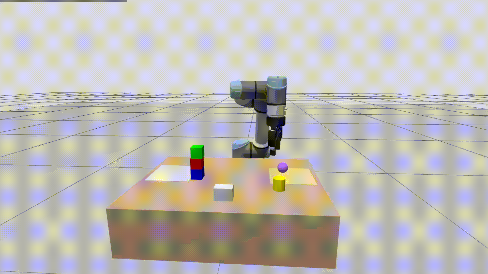
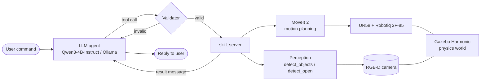
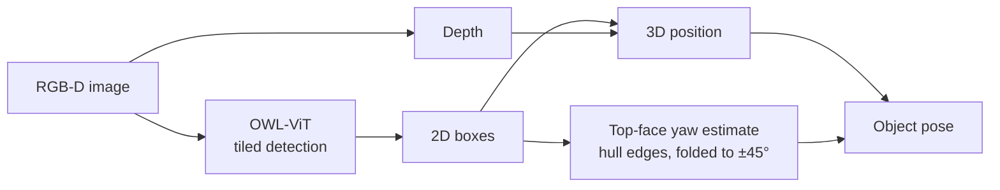
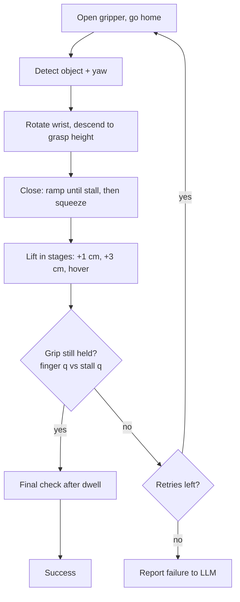
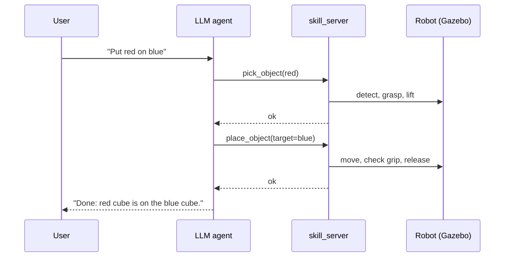

# UR5e + Local LLM + 3D Vision

[](https://docs.ros.org/en/jazzy/) [](https://gazebosim.org/home) [](https://opensource.org/licenses/MIT)

A simulated **UR5e** robot arm that you control in plain English. A small **local LLM** (Qwen3-4B-Instruct via Ollama) decides *what* to do; deterministic, validated skills decide *how*. RGB-D vision finds the objects, MoveIt 2 plans the motion, and a Robotiq 2F-85 gripper picks things up with real physics.

> "Put the red cube on the blue one, then sort the rest into the left zone."

Everything runs offline on a single laptop GPU (RTX 4050, 6 GB).

**Stack:** ROS 2 Jazzy · Gazebo Harmonic · MoveIt 2 (pymoveit2) · Ollama (qwen3:4b-instruct) · OWL-ViT · Python



---

## Key idea: the LLM never touches joints

The model only chooses from a small set of tools. Every call is validated before it reaches the robot, so a hallucinated or malformed plan is rejected instead of executed.

| Tool | What it does |
|---|---|
| `detect_objects` | Locate objects via RGB-D + open-vocabulary detection |
| `pick_object` | Pick a cube (`red`/`green`/`blue`) or an extra (`can`/`ball`/`block`) |
| `place_object` | Place on the table at (x, y) or on top of another object |
| `place_relative` | Place left/right/in front of/behind a reference cube |
| `place_in_zone` | Place inside a named table zone |
| `sort_cubes` | Sort cubes into zones |
| `build_tower` | Stack cubes |
| `move_home` | Return to the home pose |

---

## Architecture



### Perception



Cubes use a fast colour detector; extra objects (can, ball, block) use OWL-ViT. Cube yaw is estimated from the top face, and the wrist rotates to match before grasping.

### Pick skill



The grip check compares finger position against the stall position recorded at grasp time. If the fingers close further than `slip_tol` the object is considered lost.

### One request, end to end



---

## Physics, not tricks

Early versions "worked" because of shortcuts. Fixing them is a big part of this project:

- **Gravity is on** for every object; nothing is held in place artificially.
- **No teleporting.** An earlier `snap_release` hack moved cubes to the target even when the gripper was empty. It is now off, and any teleport is logged as `TELEPORT:`.
- **Real slip detection** based on finger position at stall.
- **Grasp height tuned from data** with a ground-truth sweep: a window about 1 cm wide (`grasp_dz = -0.0075`), with 6/6 successful picks at the chosen value.

---

## Status

- Picking with the Robotiq under real physics: reliable (cube, can, ball, block)
- Cube yaw estimation and wrist alignment: verified on the simulated robot
- LLM knows six objects (3 cubes + can, ball, block)
- Benchmark: 35 cases (cubes, stacking, zones, relational placement, extra objects, refusals). **Baseline is being re-recorded** now that the physics are real; older numbers came from a teleporting setup and are not comparable.

---

## Quick start

Prerequisites: Ubuntu 24.04, ROS 2 Jazzy, Gazebo Harmonic, MoveIt 2, [Ollama](https://ollama.com) with `qwen3:4b-instruct`, a GPU with ~6 GB VRAM.

```bash
cd ~/CODE/ur_llm_ws
colcon build --symlink-install
source /opt/ros/jazzy/setup.bash && source install/setup.bash
```

Run each in its own terminal (source the workspace in every one):

```bash
scripts/kill_sim.sh                       # clear any stale simulator
ros2 launch ur_sim_bringup sim.launch.py  # Gazebo + MoveIt + robot
ros2 run ur_perception detect_objects     # cube detection
ros2 run ur_skills skill_server           # validated skills
ros2 run ur_llm_bridge llm_bridge         # chat with the robot
```

For can / ball / block, also run `ros2 run ur_perception detect_open`.

### Tools for tuning and testing

```bash
ros2 run ur_llm_bridge llm_benchmark --only pick_red stack_red_blue --repeat 2
ros2 run ur_llm_bridge grasp_sweep --dz -0.0115 -0.0075 -0.0035 --trials 6
```

Run only one of `llm_bridge`, `llm_benchmark`, `grasp_sweep` at a time. After a benchmark, `grep TELEPORT` on the skill server log should be empty.

---

## Key parameters (`skill_server`)

| Param | Default | Meaning |
|---|---|---|
| `grasp_dz` | -0.0075 | Pad height relative to object centre (m) |
| `squeeze` | 0.08 | Extra closing beyond stall (rad) |
| `slip_tol` | 0.025 | Slip threshold (rad) |
| `grasp_retries` | 2 | Automatic retries on a lost grasp |
| `use_yaw` | true | Rotate the wrist to match cube yaw |
| `snap_release` | false | Teleport on release (never for benchmarks) |

Change live with `ros2 param set /skill_server grasp_dz -0.0075`.

---

## Performance notes

On this hardware the LLM, not the robot, dominates latency. The agent uses a compact system prompt, capped output length, and a fixed context size to avoid model reloads. Per-call timing is logged. Gazebo, OWL-ViT and Qwen3-4B-Instruct share 6 GB VRAM, so check that `ollama ps` shows 100% GPU.

## Known limitations

- One skill at a time; a failed place leaves the robot holding the object
- One object per colour (no duplicates)
- Narrow grasp window: new object sizes or gripper pads need a new sweep
- Tower, sort and relational references work with cubes only
- The ball's collision shape is a cylinder (visual is a sphere) so it cannot roll

## Roadmap

- Record and tag the new physical benchmark baseline
- Show extra objects in the scene summary
- Recovery after a failed place
- Higher-resolution camera, OWLv2 / Grounding DINO, SAM masks
- Voice input (Whisper) and a vision-language model

## Repo layout

```
src/
  ur_sim_bringup/   launch files, Gazebo world
  ur_perception/    detection, yaw estimation
  ur_skills/        skill_server, pick/place logic
  ur_llm_bridge/    agent, benchmark, grasp_sweep
scripts/            kill_sim.sh
```

## License

MIT. See `LICENSE`.